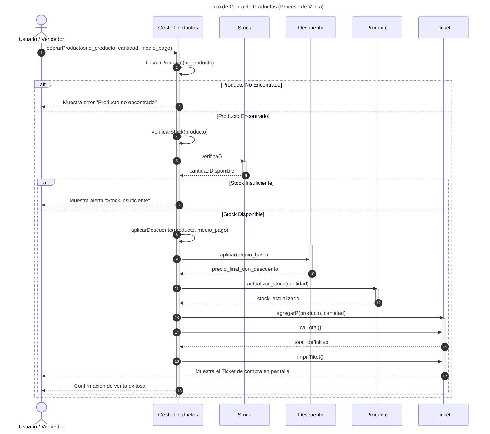

# Diagrama Secuencial del Proyecto Arco-Iris (Mermaid)

```mermaid
sequenceDiagram
    autonumber
    actor Vendedor as Usuario / Vendedor
    participant Gestor as GestorProductos
    participant Stk as Stock
    participant Desc as Descuento
    participant Prod as Producto
    participant Tkt as Ticket

    title Flujo de Cobro de Productos (Proceso de Venta)

    Vendedor->>Gestor: cobrarProductos(id_producto, cantidad, medio_pago)
    activate Gestor

    Gestor->>Gestor: buscarProducto(id_producto)

    alt Producto No Encontrado
        Gestor-->>Vendedor: Muestra error "Producto no encontrado"
    else Producto Encontrado
        Gestor->>Gestor: verificarStock(producto)
        Gestor->>Stk: verifica()
        activate Stk
        Stk-->>Gestor: cantidadDisponible
        deactivate Stk

        alt Stock Insuficiente
            Gestor-->>Vendedor: Muestra alerta "Stock insuficiente"
        else Stock Disponible
            Gestor->>Gestor: aplicarDescuento(producto, medio_pago)
            activate Desc
            Gestor->>Desc: aplicar(precio_base)
            Desc-->>Gestor: precio_final_con_descuento
            deactivate Desc

            Gestor->>Prod: actualizar_stock(cantidad)
            activate Prod
            Prod-->>Gestor: stock_actualizado
            deactivate Prod

            Gestor->>Tkt: agregarP(producto, cantidad)
            activate Tkt
            Gestor->>Tkt: calTotal()
            Tkt-->>Gestor: total_definitivo
            
            Gestor->>Tkt: impriTiket()
            Tkt-->>Vendedor: Muestra el Ticket de compra en pantalla
            deactivate Tkt
            
            Gestor-->>Vendedor: Confirmación de venta exitosa
        end
    end
    deactivate Gestor
```